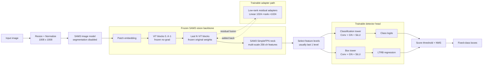
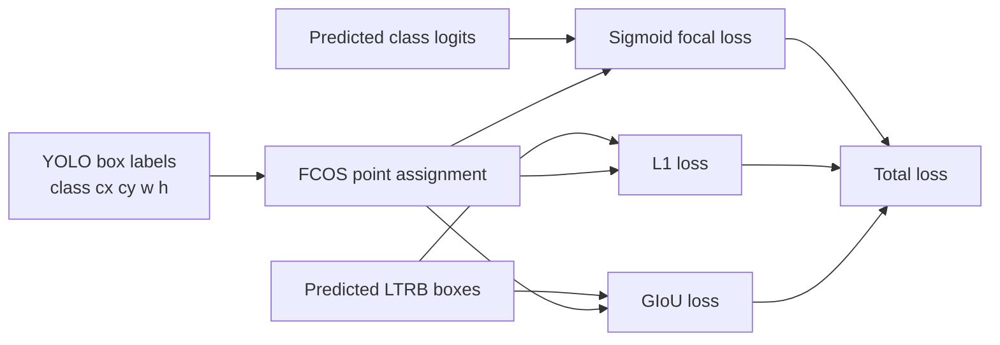

# SAM3-BoxAdapter Network Structure

This diagram summarizes the prototype implemented in `scripts/sam3_frozen_detector.py`.
The SAM3 image backbone is frozen. Only the FCOS-style detector head and optional
low-rank residual adapters are trainable.

## Training Objective

## Checkpoint Contents

The detector checkpoint stores only task-specific weights:

- detector head state dict;
- adapter state dict;
- adapter configuration;
- number of classes, feature level count, and input resolution.

It does not include the SAM3 checkpoint.
